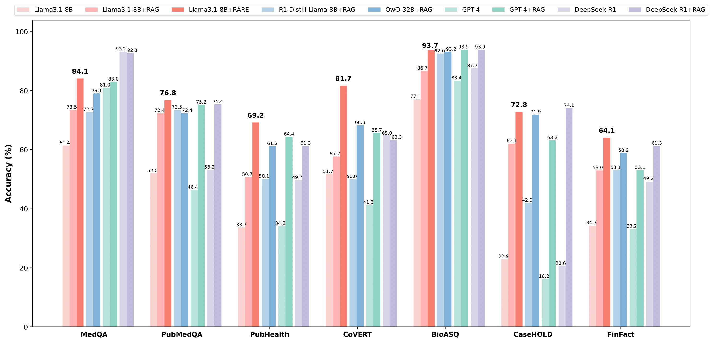
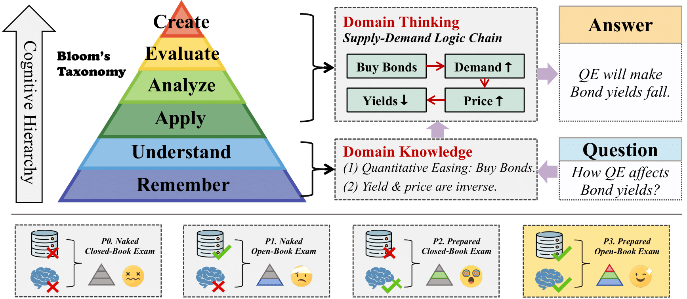
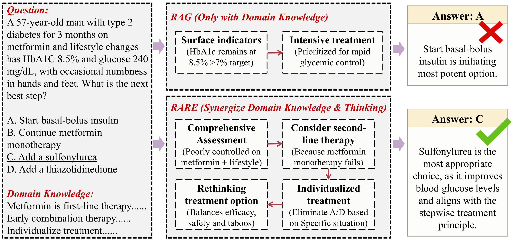

<h1 align="center">   RARE: Retrieval-Augmented Reasoning Modeling </h1>

<p align="center">
<a href='https://arxiv.org/abs/2503.23513v2'></a>  
<a href='https://huggingface.co/datasets/yuhkalhic/rare_share'></a>
<a href="https://opensource.org/license/apache-2-0" target="_blank"></a>
<a href="https://github.com/Open-DataFlow/RARE" target="_blank"></a>
</p>

<h5 align="center"> If you like our project, please give us a star ⭐ on GitHub for the latest update.</h5>

## 💡 Overview

We propose the **RARE** framework, a novel paradigm that decouples knowledge storage from reasoning modeling. This framework accelerates reasoning modeling via bypassing rote memorization of lower-level knowledge. *All progress will be openly shared and continuously updated in this repository!*

<table class="center">
    <tr>
        <td width=100% style="border: none"></td>
    </tr>
    <tr>
        <td width="100%" style="border: none; text-align: center; word-wrap: break-word">
              Performance of RARE versus baselines on diverse benchmarks (medical, legal, financial, and more).
      </td>
    </tr>
</table>

<table class="center">
    <tr>
        <td width=100% style="border: none"></td>
    </tr>
    <tr>
        <td width="100%" style="border: none; text-align: center; word-wrap: break-word">
              Motivation of RARE. Left: A pyramid-shaped Bloom’s Taxonomy, illustrating the cognitive hierarchy from basic "Remember" to advanced "Evaluate" and "Create" levels. Right: The correspondence between Domain Knowledge and Domain Thinking with Bloom’s cognitive hierarchy (example related to government bond yields). In contrast to domain knowledge, domain thinking corresponds to the higher-order cognitive process—although relatively <strong>rare</strong>, it plays a crucial role.
      </td>
    </tr>
</table>

<table class="center">
    <tr>
        <td width=100% style="border: none"></td>
    </tr>
    <tr>
        <td width="100%" style="border: none; text-align: center; word-wrap: break-word">
              Demonstration of RARE with real medical case studies. Compared to RAG (only with domain knowledge), RARE (combining domain knowledge and thinking) enables LLMs to reason more deeply and accurately. RAG depends only on surface indicators, hastily concluding that the patient requires immediate glucose-lowering intervention, leading to an incorrect answer. In contrast, RARE integrates both clinical indicators and the effectiveness of prior treatment, carefully reasoning that the patient needs second-line therapy while providing a individualized treatment plan—ultimately arriving at the correct answer.
      </td>
    </tr>
</table>

<!-- ## 📣 Latest News -->

## 🔧 Installation

Complete the environment deployment for this project through the following methods.

```
git clone https://github.com/Open-DataFlow/RARE
cd RARE

conda create -n rare python=3.10
conda activate rare

pip install -r requirements.txt
```

## 🏃 Quick Start

We provide two complete examples, one for pure language and one for visual-language tasks.

- Train with [PubMedQA](https://arxiv.org/abs/1909.06146) (text-only dataset) 
```
bash demo/llama_pubmedqa_rare.sh
```

- Train with [MM-RAIT](https://arxiv.org/abs/2502.17297) (multi-modal dataset)
```
bash demo/qwenvl_mmrait_rare.sh
```

## ✨ Main Experiments

### 📋 Data Preparation <a id="Data-Preparation"></a>

We provide methods for preprocessing data from different sources.

1. Format Original Data <a id="step1"></a>

- process medqa and pubmed

```
huggingface-cli download --repo-type dataset --resume-download yuhkalhic/rare_share --local-dir process/rare_share
unzip process/rare_share/system=planner_addret,dataset=all_dev,debug=False.zip -d process/rare_share/system=planner_addret,dataset=all_dev,debug=False
unzip process/rare_share/system=planner_addret,dataset=all_train,debug=False.zip -d process/rare_share/system=planner_addret,dataset=all_train,debug=False
unzip process/rare_share/system=planner_addret,dataset=all_test,debug=False.zip -d process/rare_share/system=planner_addret,dataset=all_test,debug=False
python process/process_medqa.py
python process/process_pubmed.py
```
- process pubhealth
```
python process/process_pubhealth.py
```
- process casehold
```
python process/process_casehold.py
```
- process finfact
```
python process/process_finfact.py
```
- process mmrait
```
huggingface-cli download whalezzz/M2RAG --repo-type dataset --local-dir process --include "fact_verify/*"
python process/process_mmrait.py
```
Through the above steps, the construction of prompts and answers for the dataset has been completed.


2. Distill Reasoning Model
```
# For medqa, pubmed, pubhealth, casehold, finfact, these steps should be done
modelscope download --model Qwen/QwQ-32B --local_dir saves/QwQ-32B
python inference/vllm_infer_text.py --model_name_or_path saves/QwQ-32B --dataset_path data/train_medqa.json --template qwen
python process/select_true.py data/train_medqa.json # Only for medqa, casehold and finfact

# For mmrait, these steps should be done
modelscope download --model Qwen/Qwen2.5-VL-32B-Instruct --local_dir saves/Qwen2.5-VL-32B-Instruct
python scripts/vllm_infer_mm.py --model_name_or_path saves/Qwen2.5-VL-32B-Instruct --dataset_path data/train_mmrait.json
python process/select_true.py data/train_mmrait.json --mm
```

After preprocessing, the data should include at least the following keys, where 'instruction', 'predict', 'id', and 'output' represent the prompt, the teaching model's thought process and answer, the data identification number, and the standard answer to the question, respectively.

```
{
      "instruction": str,
      "predict": str,
      "id": str，
      "output"： str
}

# or multimodal data:
{
      "messages": list,
      "images": list,
      "id": str，
      "output"： str
}
```


### 🏋️‍♂️ Model Training

Our training code supports the types of models, and here are some examples of their specific names.

- meta-llama/Llama-3.1-8B-Instruct
- Qwen/Qwen2.5-7B-Instruct
- mistralai/Mistral-7B-Instruct-v0.3

You need to modify the value of the fsdp_config parameter to correspond to different models. If you wish to select more different models, you can choose to use llamafactory to start training or modify the code in train/sft.py

- Training using only text datasets (medqa, pubmed, pubhealth, casehold, finfact)
```
bash train/sft.sh
```

- Training with multimodal datasets (mmrait)
```
accelerate launch --config_file train/accelerate_config_mm.yaml train/train.py train/training_args_mm.yaml

python saves/mmrait-qwenvl/zero_to_fp32.py saves/mmrait-qwenvl  --safe_serialization  # Convert deepspeed checkpoints
```

### 🔮 Model Inference

Our inference script supports five types of models, and here are some examples of their specific names.

- meta-llama/Llama-3.1-8B-Instruct
- Qwen/Qwen2.5-7B-Instruct
- mistralai/Mistral-7B-Instruct-v0.3
- deepseek-ai/DeepSeek-R1-Distill-Llama-8B
- Qwen/Qwen2.5-VL-7B-Instruct

For the test set, at least [step 1](#step1) of preprocessing should be completed, including questions and standard answers.
Parameters that are strongly recommended to adjust include model_name_or_path, dataset_path, template, prediction_key, and tensor_parallel_size, which represent the model path, dataset path, prompt template (corresponding to the pre-trained model), the key name where inference results are saved in the dataset, and the number of parallel processes (corresponding to the number of your GPUs).

```
python inference/vllm_infer_text.py  --model_name_or_path saves/medqa-llama --dataset_path data/test_medqa.json --template llama --prediction_key llm_predict_rare_llama --tensor_parallel_size 8

# multimodal
python inference/vllm_infer_mm.py --model_name_or_path saves/mmrait-qwenvl --dataset_path data/test_mmrait.json --prediction_key llm_predict_rare_qwen2vl --tensor_parallel_size 4
```

<details>

<summary> API Inference </summary>

---------

You can also use API calls to test closed-source models for baseline methods (e.g., RAG). Below is an example that uses the POST method to call the API for inference. You need to specify the model name, your API URL and key, the dataset path, and the number of concurrent workers.
```
python inference/api_infer_post.py --model_name 'your_model_name' --api_url 'your_api_url' --api_key 'your_api_key'  --dataset_path data/test_medqa.json --concurrency 30
```
Then, you can use the exact same method for evaluation. Note that you need to set `--prediction_key` to the name of the model you used. 

```
python eval/eval.py --file data/test_medqa.json --prediction_key 'your_model_name'
```
---------

</details>

### 📊 Output Evaluation

The inference script extracts the keys to be evaluated through regular expressions and compares them with the standard answers, ultimately calculating the accuracy.

```
python eval/eval.py --file data/test_medqa.json --prediction_key llm_predict_rare_llama
```

## Analysis and Discussion

### Preliminary Experiment
1. Obtain Pre-experimental Data

You first need to prepare the data required for the pre-experiment. The pre-experiment uses three datasets in total (PubHealth, CaseHOLD, FinFact), which need to be processed with different scripts.
- pre-process pubhealth, casehold, finfact 
```
python Pre_Experiment/data/preprocess_pubhealth.py --input data/train_pubhealth.json --output Pre_Experiment/data/pre_pubhealth.json

python Pre_Experiment/data/preprocess_casehold.py --input data/train_casehold.json --output Pre_Experiment/data/pre_casehold.json

python Pre_Experiment/data/preprocess_finfact.py --input data/train_finfact.json --output Pre_Experiment/data/pre_finfact.json
```
2. Get Models Required

Add special tokens to the model to better extract the loss values corresponding to these tokens.
```
python Pre_Experiment/customize_model.py --model_name_or_path meta-llama/Llama-3.1-8B-Instruct --output_dir Pre_Experiment/model
```
Download spaCy English small model (`en_core_web_sm`) for document key information extraction and text preprocessing
```
huggingface-cli download --resume-download spacy/en_core_web_sm --local-dir Pre_Experiment/model
```
3. Conduct Preliminary Experiments
Then you can use the following bash script to conduct pre-experiments:
```
bash Pre_Experiment/pre_experiment.sh
```
Experiment results are saved in:  
`Pre_Experiment/result/pre_experiment_{dataset_name}_{retrieval_ratio}_4.json`

Where:
- `{dataset_name}`: Name of dataset (e.g., `pubhealth`, `casehold`, `finfact`)
- `{retrieval_ratio}`: Ratio used (0-4) from `--retrieval_ratio` parameter

Example files:
- `pre_experiment_pubhealth_1_4.json` (used 1/4 of retrieval content)

### PEFT and DEFT

1. PEFT

In section 4.2, we explored the feasibility of using parameter-efficient fine-tuning with RARE as a replacement for full parameter fine-tuning. We found that using rank=64 or 128 could achieve good results. Thanks to LLaMA-Factory, we completed this exploration based on their project. Here, we provide examples of the training scripts we used, divided into a training script and a script for merging the LoRA adapter with the original model.

- Integrating deepspeed and LLaMA-Factory to train using the RARE strategy

```
accelerate launch --config_file train/accelerate_config.yaml train/train.py train/training_args_lora.yaml
```

- Merging the trained LoRA Adapter with the original model for inference

```
llamafactory-cli export train/merge_lora.yaml
```

- These two commands can replace the commands marked with "# train" in demo/llama_pubmedqa_rare.sh to perform a complete trial

2. DEFT

In appendix A.2, we examined the data efficiency of the RARE strategy. This section does not require additional scripts; you only need to extract subsets from the training data obtained in the previous [Data Preparation](#Data-Preparation) step according to certain percentages. Then, following the example workflow in the demo, train the base model with different sized subsets, complete the inference and evaluation processes to verify data efficiency.


### Reinforcement Learning
You first need to use `RL_KTO/process_kto.py` to process the data into the format required by KTO.
```
# You can perform similar operations on all seven datasets.
python RL_KTO/process_kto.py --input_path data/train_covert.json --output_path RL_KTO/data/train_covert_kto.json
```
Then you can use the following bash script to train KTO:
```
bash RL_KTO/train_kto.sh
```

## ✏️ TODO List
- [x] A preliminary experiment to demonstrate the dynamics and effectiveness of RARE.
- [x] More results on parameter-efficient fine-tuning and data-efficient fine-tuning.
- [x] More results on reinforcement learning.
- [ ] More results on multi-task and cross-task learning.
- [ ] More results on diverse model sizes alongside the backbones.
- [ ] Releasing RARE 2.0 (Stay Tuned!)


## 📖 Citation

If you find this work helpful, please cite our paper:
```bibtex
@article{wang2025rare,
  title={RARE: Retrieval-Augmented Reasoning Modeling},
  author={Wang, Zhengren and Yu, Jiayang and Ma, Dongsheng and Chen, Zhe and Wang, Yu and Li, Zhiyu and Xiong, Feiyu and Wang, Yanfeng and Tang, Linpeng and Zhang, Wentao and others},
  journal={arXiv preprint arXiv:2503.23513},
  year={2025}
}
```

## ❤️ Acknowledgement

This repo benefits from: [LLaMA-Factory](https://github.com/hiyouga/LLaMA-Factory), [s1](https://github.com/simplescaling/s1). Thanks for wonderful works.

<!-- - [LLaMA-Factory](https://github.com/hiyouga/LLaMA-Factory)
- [s1](https://github.com/simplescaling/s1)
- [Search-o1](https://github.com/sunnynexus/Search-o1) -->
<!-- Thanks for wonderful works. -->
<!-- [Search-o1](https://github.com/sunnynexus/Search-o1) -->

## 📞 Contact

For any questions or feedback, please reach out to us at [wzr@stu.pku.edu.cn](wzr@stu.pku.edu.cn).
